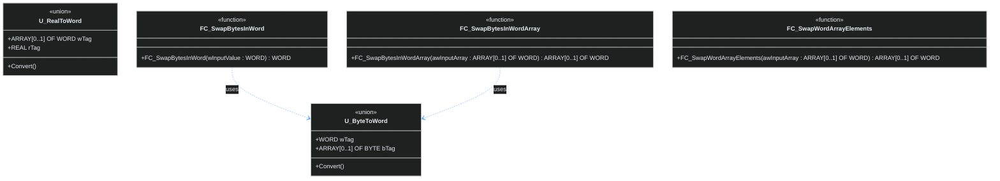

# Диаграмма: Коммуникация и преобразования данных

<style>
.diagram-container {
    width: 100%;
    overflow-x: auto;
    background: #1e1e1e;
    border: 1px solid #3f3f46;
    border-radius: 8px;
    padding: 20px;
    margin: 20px 0;
}

.mermaid {
    width: 100%;
    min-width: 600px;
}
</style>

## Утилиты для обмена данными

<div class="diagram-container">



</div>

## Описание компонентов

### Объединения (UNION)

#### U_ByteToWord
Преобразование между WORD (16-бит) и массивом из 2 байтов:
```iecst
TYPE U_ByteToWord :
UNION
    wTag: WORD;
    bTag: ARRAY [0..1] OF BYTE;
END_UNION
END_TYPE
```

**Применение:**
- Разбор WORD на отдельные байты
- Сборка WORD из двух байтов
- Работа с младшим и старшим байтами

#### U_RealToWord  
Преобразование между REAL (32-бит) и массивом из 2 WORD:
```iecst
TYPE U_RealToWord :
UNION
    wTag: ARRAY [0..1] OF WORD;
    rTag: REAL;
END_UNION
END_TYPE
```

**Применение:**
- Передача REAL значений через Modbus (2 регистра)
- Преобразование IEEE 754 в целочисленное представление
- Низкоуровневый доступ к битам числа с плавающей точкой

### Функции преобразования

#### FC_SwapBytesInWord
Меняет местами байты в WORD (Little-endian ↔ Big-endian):
```iecst
Input:  16#1234
Output: 16#3412
```

**Использование:**
- Протоколы с разным порядком байтов
- Ethernet/IP, Profinet (Big-endian)
- Modbus RTU/ASCII (Little-endian)

#### FC_SwapBytesInWordArray
Применяет операцию смены байтов к каждому элементу массива WORD:
```iecst
Input:  [16#1234, 16#5678]
Output: [16#3412, 16#7856]
```

#### FC_SwapWordArrayElements
Меняет местами элементы массива WORD:
```iecst
Input:  [16#1234, 16#5678]
Output: [16#5678, 16#1234]
```

## Типовые сценарии использования

### 1. Обмен REAL через Modbus
```iecst
VAR
    uRealConverter : U_RealToWord;
    awModbusRegisters : ARRAY [0..1] OF WORD;
    rTemperature : REAL := 25.6;
END_VAR

// Отправка REAL значения
uRealConverter.rTag := rTemperature;
awModbusRegisters := FC_SwapWordArrayElements(uRealConverter.wTag);

// Прием REAL значения  
uRealConverter.wTag := FC_SwapWordArrayElements(awModbusRegisters);
rTemperature := uRealConverter.rTag;
```

### 2. Обработка данных с разным порядком байтов
```iecst
VAR
    wEthernetData : WORD := 16#1234;  // Big-endian из сети
    wPLCData : WORD;                  // Little-endian для ПЛК
END_VAR

// Преобразование порядка байтов
wPLCData := FC_SwapBytesInWord(wEthernetData);
```

### 3. Работа с отдельными байтами
```iecst
VAR
    uByteConverter : U_ByteToWord;
    bHighByte, bLowByte : BYTE;
    wResult : WORD;
END_VAR

// Сборка WORD из байтов
uByteConverter.bTag[0] := bLowByte;   // Младший байт
uByteConverter.bTag[1] := bHighByte;  // Старший байт
wResult := uByteConverter.wTag;

// Разбор WORD на байты
uByteConverter.wTag := 16#1234;
bLowByte := uByteConverter.bTag[0];   // 16#34
bHighByte := uByteConverter.bTag[1];  // 16#12
```

## Поддерживаемые протоколы

- **Modbus RTU/TCP**: Работа с регистрами и преобразование REAL
- **Ethernet/IP**: Обработка данных с сетевым порядком байтов
- **Profinet**: Работа с различными форматами данных
- **Custom протоколы**: Гибкое преобразование форматов

---

## Связанные разделы

### Коммуникация
- [Communication](../Communication.md) - Подробное описание коммуникационных возможностей

### Аналоговые сигналы для протоколов
- [FB_AnalogSignal4_20mA](../signal/analog/FB_AnalogSignal4_20mA.md) - Токовая петля для Modbus
- [FB_UniversalAnalogSignal](../signal/analog/FB_UniversalAnalogSignal.md) - Универсальные аналоговые входы

### Управление устройствами
- [FB_BasicControl](../control/FB_BasicControl.md) - Базовое управление через сеть
- [FB_FrequencyControl](../control/FB_FrequencyControl.md) - Управление ЧРП через протоколы

### Другие диаграммы  
- [Обработка сигналов](signals-diagram.md){:target="_blank"}
- [Механизмы и управление](mechanisms-diagram.md){:target="_blank"}
- [Полная диаграмма](../full-diagram.md){:target="_blank"}

### Документация
- [Начало работы](../getting-started.md) - Примеры интеграции протоколов
- [Архитектура библиотеки](../diagram.md) - Общий обзор

### Навигация
[Обзор архитектуры](../diagram.md) | [Главная](../index.md)