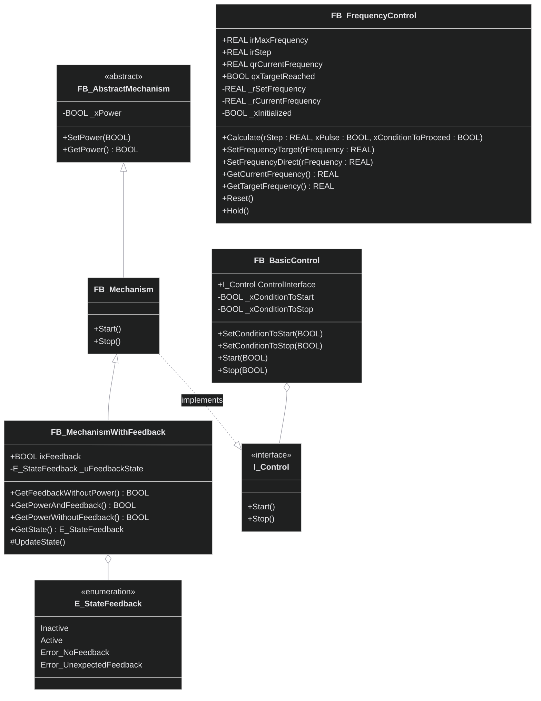

# Диаграмма: Механизмы и управление

## Иерархия механизмов и блоки управления

## Описание компонентов

### Базовые механизмы
- **FB_AbstractMechanism**: Абстрактный базовый класс для всех механизмов
  - Управляет состоянием питания устройства
  - Предоставляет базовую функциональность включения/выключения

- **FB_Mechanism**: Базовая реализация механизма
  - Реализует интерфейс `I_Control`
  - Предоставляет методы `Start()` и `Stop()`
  - Наследует управление питанием от базового класса

- **FB_MechanismWithFeedback**: Механизм с диагностикой обратной связи
  - Расширяет базовый механизм функциями диагностики
  - Контролирует соответствие команды и фактического состояния
  - Определяет состояния ошибок (нет обратной связи, неожиданная обратная связь)

### Управление
- **I_Control**: Стандартный интерфейс управления
  - Унифицирует команды `Start()` и `Stop()` для всех устройств
  - Обеспечивает полиморфизм в системах управления

- **FB_BasicControl**: Базовое управление с условиями
  - Позволяет задавать условия для запуска и остановки
  - Реализует логику блокировок и разрешений

- **FB_FrequencyControl**: Управление частотными преобразователями
  - Плавное изменение частоты с заданным шагом
  - Контроль достижения целевой частоты
  - Функции удержания и сброса

### Перечисления
- **E_StateFeedback**: Состояния обратной связи механизмов
  - `Inactive`: Механизм неактивен
  - `Active`: Механизм работает нормально
  - `Error_NoFeedback`: Ошибка - нет обратной связи при команде запуска
  - `Error_UnexpectedFeedback`: Ошибка - есть обратная связь при команде остановки

## Принципы использования

### Наследование
Все механизмы наследуют базовую функциональность управления питанием и могут быть расширены специфичными возможностями.

### Интерфейсы
Единый интерфейс `I_Control` позволяет управлять различными типами механизмов одинаково.

### Диагностика
Механизмы с обратной связью автоматически контролируют корректность выполнения команд.

---

## 🔗 Связанные разделы

### Базовые механизмы
- [🏗️ FB_AbstractMechanism](../mechanism/FB_AbstractMechanism.md) - Абстрактный базовый класс
- [⚙️ FB_Mechanism](../mechanism/FB_Mechanism.md) - Базовая реализация механизма  
- [🔄 FB_MechanismWithFeedback](../mechanism/FB_MechanismWithFeedback.md) - Механизм с диагностикой

### Управление
- [🎛️ FB_BasicControl](../control/FB_BasicControl.md) - Базовое управление с условиями
- [📊 FB_FrequencyControl](../control/FB_FrequencyControl.md) - Управление частотными преобразователями

### Сигналы для механизмов
- [📤 FB_SignalWithFeedback](../signal/discrete/FB_SignalWithFeedback.md) - Контроль обратной связи
- [🔄 FB_SignalWithTrigger](../signal/discrete/FB_SignalWithTrigger.md) - Детекция команд управления

### Другие диаграммы
- [🔄 Обработка сигналов](signals-diagram.md){:target="_blank"}
- [📡 Коммуникация](communication-diagram.md){:target="_blank"}
- [📊 Полная диаграмма](../full-diagram.md){:target="_blank"}

### Навигация
[⬅️ Обзор архитектуры](../diagram.md) | [🏠 Главная](../index.md)