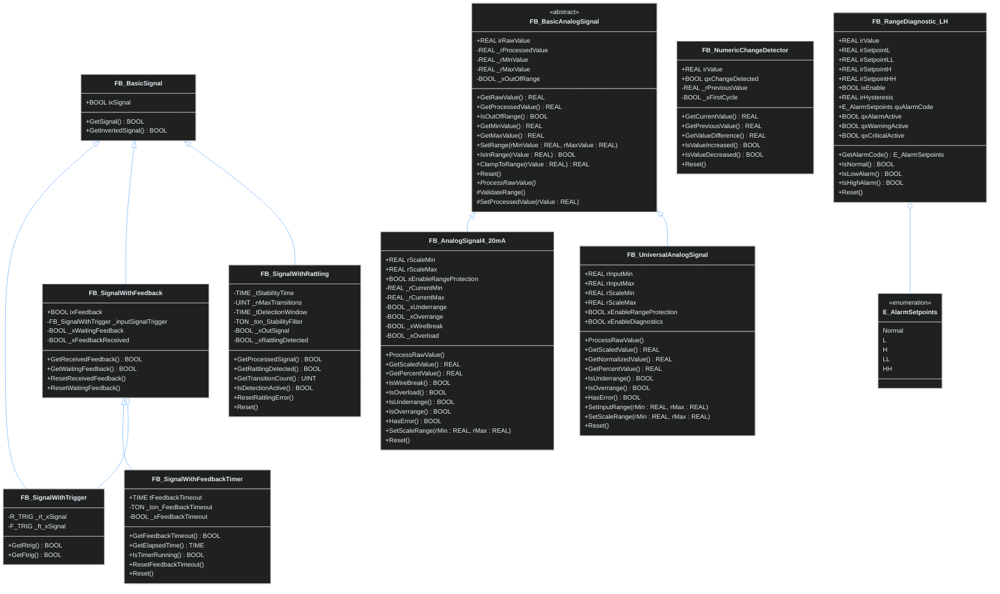

# Диаграмма: Обработка сигналов

## Дискретные и аналоговые сигналы

## Описание компонентов

### Дискретные сигналы
- **FB_BasicSignal**: Базовый функциональный блок для работы с булевыми сигналами
- **FB_SignalWithTrigger**: Расширяет базовый сигнал детекцией фронтов (R_TRIG, F_TRIG)
- **FB_SignalWithFeedback**: Добавляет контроль обратной связи к базовому сигналу
- **FB_SignalWithFeedbackTimer**: Расширяет обратную связь таймаутом ожидания
- **FB_SignalWithRattling**: Фильтрация дребезга контактов с настраиваемыми параметрами

### Аналоговые сигналы
- **FB_BasicAnalogSignal**: Абстрактный базовый класс для обработки аналоговых сигналов
- **FB_AnalogSignal4_20mA**: Специализированный блок для токовой петли 4-20мА с диагностикой
- **FB_UniversalAnalogSignal**: Универсальный блок для различных типов аналоговых входов

### Диагностика сигналов
- **FB_NumericChangeDetector**: Обнаружение и анализ изменений числовых значений
- **FB_RangeDiagnostic_LH**: Четырехуровневая система контроля параметров (L, LL, H, HH)
- **E_AlarmSetpoints**: Перечисление уровней аварий и предупреждений

---

## Связанные разделы

### Дискретные сигналы
- [FB_BasicSignal](../signal/discrete/FB_BasicSignal.md) - Базовый дискретный сигнал
- [FB_SignalWithFeedback](../signal/discrete/FB_SignalWithFeedback.md) - Контроль обратной связи
- [FB_SignalWithFeedbackTimer](../signal/discrete/FB_SignalWithFeedbackTimer.md) - Таймаут обратной связи

### Аналоговые сигналы  
- [FB_BasicAnalogSignal](../signal/analog/FB_BasicAnalogSignal.md) - Базовый аналоговый сигнал
- [FB_AnalogSignal4_20mA](../signal/analog/FB_AnalogSignal4_20mA.md) - Токовая петля 4-20мА
- [FB_UniversalAnalogSignal](../signal/analog/FB_UniversalAnalogSignal.md) - Универсальный аналоговый вход

### Диагностика
- [FB_NumericChangeDetector](../signal/analog/FB_NumericChangeDetector.md) - Детекция изменений значений
- [FB_RangeDiagnostic_LH](../signal/analog/FB_RangeDiagnostic_LH.md) - Контроль уставок

### Другие диаграммы
- [Механизмы и управление](mechanisms-diagram.md){:target="_blank"}
- [Коммуникация](communication-diagram.md){:target="_blank"}
- [Полная диаграмма](../full-diagram.md){:target="_blank"}

### Навигация
[Обзор архитектуры](../diagram.md) | [Главная](../index.md)